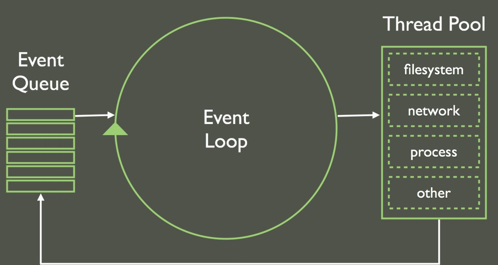

# Node.js
## Alkindar Rodrigues
SP3029956

---

### História
- Lançado em 2009
- Isola o ambiente v8 do Chrome
- Leva o JS ao back-end e outras plataformas

--

#### Propostas
- Unificar o desenvolvimento web ao redor de uma linguagem
- Facilitar a geração dinâmica (server-side) de páginas web
- Aumentar o throughtput e escalabilidade

---

### Features
- Arquitetura orientada a eventos
- I/O assíncrono
- Package manager próprio

---

## Detalhes técnicos

--

### Single Thread Event Loop
- Uma thread (main), que cria outras a partir de eventos
- Uma fila de tarefas compartilhada é usada para controlar pendencias 

--

- Implementa o pattern observer para identificar mudanças nas tarefas filhas
- Quando notificada a thread main ativa o callback da thread filha

--

<small>Figura 1: Esquema de funcionamento do Event Loop</small>

---

### Outros detalhes
- Possibilidade de add-ons em C/C++
- Stdlib enorme para operações como:
  - Construção de apis
  - Manipulação de arquivos
  - Criptografia
- REPL

---

## Algumas libs

--

### Back end
- Express
- NestJS

--

### Outras
- Twit
- Open-wa
- Iteration